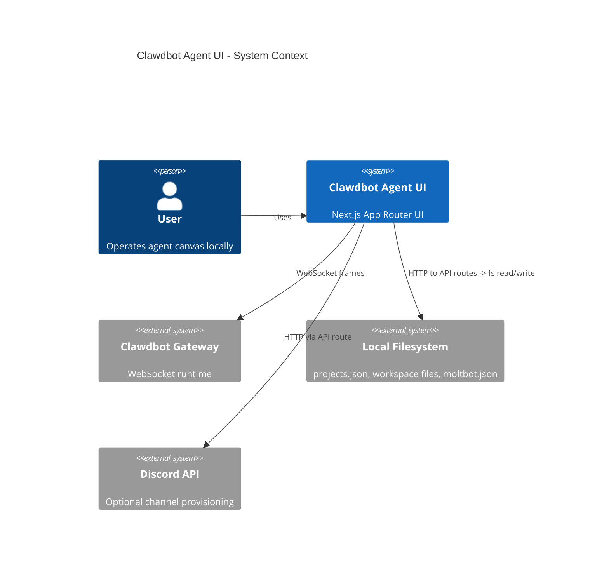
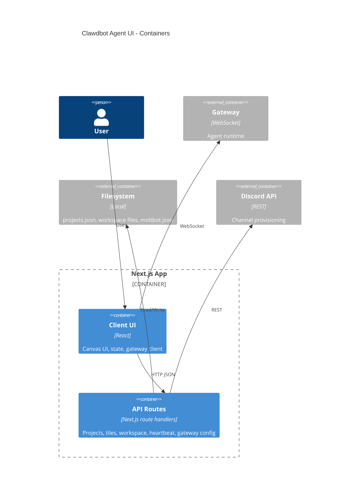

# Architecture

## High-level overview & goals
This repo is a local-first, single-user Next.js App Router UI for managing Clawdbot/Moltbot agents on a canvas. It provides:
- A canvas-based workspace UI for multiple agent tiles.
- Local persistence for projects/tiles via a JSON store on disk.
- Integration with the Clawdbot runtime via a WebSocket gateway.
- Optional Discord channel provisioning for agents.

Primary goals:
- **Local-first**: zero external DB, fast startup, filesystem-backed state.
- **Clear boundaries**: client UI vs server routes vs external gateway/config.
- **Predictable state**: single source of truth for project/tile state.
- **Maintainability**: feature-focused modules, minimal abstractions.

Non-goals:
- Multi-tenant or multi-user concurrency.
- Server-side rendering of data from external services.

## Architectural style
**Layered + vertical slice (feature-first)** within Next.js App Router:
- UI components + feature state in `src/features`.
- Shared utilities and adapters in `src/lib`.
- Server-side route handlers under `src/app/api`.

This keeps feature cohesion high while preserving a clear client/server boundary.

## Main modules / bounded contexts
- **Canvas UI** (`src/features/canvas`): React Flow canvas, tiles, editor UI, local in-memory state + actions.
- **Projects** (`src/lib/projects`, `src/app/api/projects`): project/tile models, store persistence, workspace files, heartbeat settings, shared project/tile resolution (`src/lib/projects/resolve.ts`), shared store normalization in `src/app/api/projects/store.ts`, server-side filesystem helpers (`src/lib/projects/fs.server.ts`) for agent cleanup.
- **Gateway** (`src/lib/gateway`): WebSocket client for agent runtime (frames, connect, request/response).
- **Clawdbot config + paths** (`src/lib/clawdbot`): read/write moltbot.json, agent list and heartbeat defaults, consolidated state/config/.env path resolution (`src/lib/clawdbot/paths.ts`).
- **Discord integration** (`src/lib/discord`, API route): channel provisioning and config binding.
- **Shared utilities** (`src/lib/*`): env, ids, names, avatars, text parsing, logging, filesystem helpers.

## Directory layout (top-level)
- `src/app`: Next.js App Router pages, layouts, global styles, and API routes.
- `src/features`: feature-first UI modules (currently canvas).
- `src/lib`: domain utilities, adapters, API clients, and shared logic.
- `src/components`: shared UI components (minimal use today).
- `src/styles`: shared styling assets.
- `public`: static assets.
- `tests`, `playwright.config.ts`, `vitest.config.ts`: automated testing.

## Data flow & key boundaries
### 1) Project + tile state
- **Source of truth**: JSON store on disk at `~/.clawdbot/agent-canvas/projects.json`.
- **Server boundary**: `src/app/api/projects/*` handles validation, persistence, and side effects.
- **Client boundary**: `AgentCanvasProvider` loads store on startup, caches in memory, and persists via API.

Flow:
1. UI dispatches action.
2. Client calls `lib/projects/client`.
3. API route mutates store + writes files/config.
4. API returns updated store.
5. Client hydrates store into runtime state.

### 2) Agent runtime (gateway)
- **Client-side only**: `GatewayClient` uses WebSocket to connect to the local Clawdbot gateway.
- **API is not in the middle**: UI speaks directly to the gateway for streaming and agent events.

Flow:
1. UI loads gateway URL/token from `/api/gateway`.
2. `GatewayClient` connects + sends `connect` request.
3. UI sends requests (frames) and receives event streams.
4. Canvas store updates tile output/state.

### 3) Workspace files + heartbeat
- **Workspace files**: `AGENTS.md`, `SOUL.md`, `IDENTITY.md`, `USER.md`, `TOOLS.md`, `HEARTBEAT.md`, `MEMORY.md`.
- **Heartbeat**: stored in `moltbot.json` agent list entries.

Flow:
1. UI requests workspace files/heartbeat via API.
2. API reads/writes filesystem + config.
3. UI reflects persisted state.

### 4) Discord provisioning
- API route calls `createDiscordChannelForAgent`.
- Uses DISCORD_BOT_TOKEN from the resolved state-dir `.env` file.
- Updates `moltbot.json` bindings and channel config.

## Cross-cutting concerns
- **Configuration**: `src/lib/env` validates env via zod; `lib/clawdbot/paths.ts` resolves config path and state dirs.
- **Logging**: `src/lib/logger` (console wrappers) used in API routes and gateway client.
- **Error handling**:
  - API routes return JSON `{ error }` with appropriate status.
  - `fetchJson` throws when `!res.ok`, surfaces errors to UI state.
- **Filesystem helpers**: `src/lib/projects/fs.server.ts` handles agent workspace/state cleanup for API routes; state/config path expansion lives in `src/lib/clawdbot/paths.ts`.
- **Projects store normalization**: `src/app/api/projects/store.ts` provides `normalizeProjectsStore` to keep active project selection consistent across routes.
- **Tracing**: `src/instrumentation.ts` registers `@vercel/otel` for telemetry.
- **Validation**: request payload validation in API routes; shared project/tile resolution in `src/lib/projects/resolve.ts`; typed payloads in `lib/projects/types`.

## Major design decisions & trade-offs
- **Local JSON store over DB**: faster iteration, local-first; trade-off is no concurrency or multi-user support.
- **WebSocket gateway direct to client**: lowest latency for streaming; trade-off is tighter coupling to the gateway protocol in the UI.
- **Feature-first organization**: increases cohesion in UI; trade-off is more discipline to keep shared logic in `lib`.
- **Node runtime for API routes**: required for filesystem access; trade-off is Node-only server runtime.

## Mermaid diagrams
### C4 Level 1 (System Context)

### C4 Level 2 (Containers/Components)

## Explicit forbidden patterns
- Do not read/write local files directly from client components.
- Do not bypass `lib/projects/client` for API calls from UI.
- Do not introduce a new persistence layer without a clear migration path from `projects.json`.
- Do not store gateway tokens or secrets in client-side persistent storage.
- Do not add new global mutable state outside `AgentCanvasProvider` for canvas data.
- Do not silently swallow errors in API routes; always return actionable errors.
- Do not add heavy abstractions or frameworks unless there is clear evidence of need.

## Future-proofing notes
- If multi-user support becomes a goal, replace the JSON store with a DB-backed service and introduce authentication at the API boundary.
- If gateway protocol evolves, isolate changes within `src/lib/gateway` and keep UI call sites stable.
