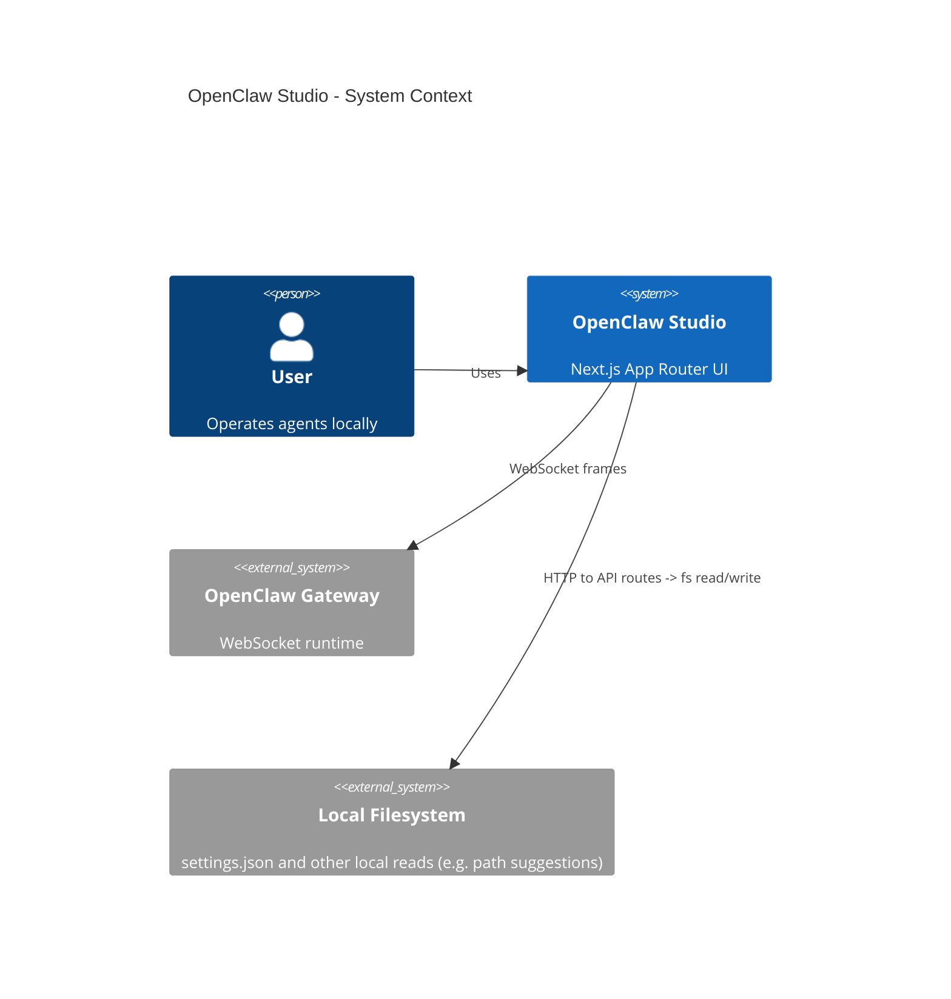
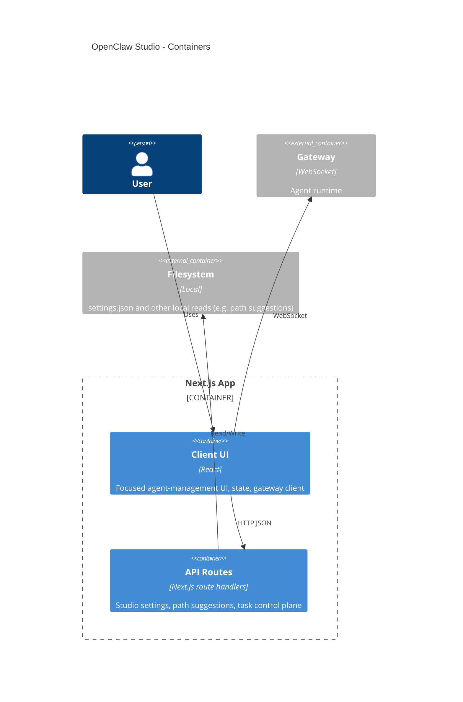

# Architecture

## High-level overview & goals
OpenClaw Studio is a gateway-first, single-user Next.js App Router UI for managing OpenClaw agents. It provides:
- A focused UI with fleet list, primary agent panel, and inspect sidebar.
- Local persistence for gateway connection + focused-view preferences via a JSON settings file.
- Direct integration with the OpenClaw runtime via a WebSocket gateway.
- Gateway-backed edits for agent config and agent files.

Primary goals:
- **Gateway-first**: agents, sessions, and config live in the gateway; Studio stores only UI settings.
- **Remote-friendly**: tailnet/remote gateways are first-class.
- **Clear boundaries**: client UI vs server routes vs external gateway/config.
- **Predictable state**: gateway is source of truth; local settings only for focused preferences + connection.
- **Maintainability**: feature-focused modules, minimal abstractions.

Non-goals:
- Multi-tenant or multi-user concurrency.
- Server-side rendering of data from external services.

## Architectural style
**Layered + vertical slice (feature-first)** within Next.js App Router:
- UI components + feature state in `src/features`.
- Shared utilities and adapters in `src/lib`.
- Server-side route handlers under `src/app/api`.

This keeps feature cohesion high while preserving a clear client/server boundary.

## Main modules / bounded contexts
- **Focused agent UI** (`src/features/agents`): focused agent panel, fleet sidebar, inspect panel, and local in-memory state + actions. The fleet sidebar includes a `New Agent` action that calls gateway config patching and works for both local and remote gateways. Agents render a status-first summary and latest-update preview driven by gateway events. Per-agent runtime controls (`model`, `thinking`) live in the chat header (`AgentChatPanel`), active runs can be stopped from the chat composer via `chat.abort`, while settings sidebar actions are focused on rename, display toggles, new session, cron list/run/delete/create, and delete (`AgentSettingsPanel`). Cron creation now uses a guided modal with template-first onboarding and a review step, scoped to the currently selected settings agent. Gateway event classification (`presence`/`heartbeat` summary refresh and `chat`/`agent` runtime streams) is centralized in bridge helpers (`src/features/agents/state/runtimeEventBridge.ts`) and consumed from one gateway subscription path in `src/app/page.tsx`. Higher-level orchestration that used to live inline in `src/app/page.tsx` is now factored into testable operations under `src/features/agents/operations/` (fleet hydration in `agentFleetHydration.ts`, chat send in `chatSendOperation.ts`, cron create in `cronCreateOperation.ts`, and config mutation queue + restart blocking in `useConfigMutationQueue.ts` and `useGatewayRestartBlock.ts`). Session setting mutations (model/thinking) are centralized in `src/features/agents/state/sessionSettingsMutations.ts` so optimistic state updates and sync/error behavior stay aligned. Studio fetches a capped amount of chat history by default (currently 200 messages) and exposes a “Load more” affordance when the transcript may be truncated.
- **Studio settings** (`src/lib/studio`, `src/app/api/studio`): local settings store for gateway URL/token and focused preferences (`src/lib/studio/settings.ts`, `src/app/api/studio/route.ts`). `src/lib/studio/coordinator.ts` now owns both the `/api/studio` transport helpers and shared client-side load/patch scheduling for gateway and focused settings.
- **Gateway** (`src/lib/gateway`): WebSocket client for agent runtime (frames, connect, request/response). Session settings sync transport (`sessions.patch`) is centralized in `src/lib/gateway/GatewayClient.ts`. The OpenClaw control UI client is vendored in `src/lib/gateway/openclaw/GatewayBrowserClient.ts` with a sync script at `scripts/sync-openclaw-gateway-client.ts`.
- **Gateway-backed config + agent-file edits** (`src/lib/gateway/agentConfig.ts`, `src/lib/gateway/agentFiles.ts`, `src/features/agents/components/AgentInspectPanels.tsx`): agent create/rename/heartbeat/delete via `config.get` + `config.patch`, agent file read/write via gateway WebSocket methods (`agents.files.get`, `agents.files.set`).
- **Heartbeat helpers** (`src/lib/gateway/agentConfig.ts`): resolves per-agent heartbeat state (enabled + schedule) by combining gateway config (`config.get`) and status (`status`) for the settings panel, triggers `wake` for “run now”, and owns the heartbeat type shapes and gateway config mutation helpers.
- **Session lifecycle actions** (`src/features/agents/state/store.tsx`, `src/app/page.tsx`): per-agent “New session” calls gateway `sessions.reset` on the current session key and resets local runtime transcript state.
- **Local OpenClaw config + paths** (`src/lib/clawdbot`): state/config path resolution with `OPENCLAW_*` env overrides (`src/lib/clawdbot/paths.ts`). Gateway URL/token in Studio are sourced from studio settings.
- **Shared agent config-list helpers** (`src/lib/gateway/agentConfig.ts`): pure `agents.list` read/write/upsert helpers used by gateway config patching to keep list-shape semantics aligned.
- **Task control plane** (`src/app/control-plane`, `src/app/api/task-control-plane`, `src/lib/task-control-plane/read-model.ts`): a read-only status board driven by Beads (`br`) JSON output. The API route is the server boundary for invoking `br` and parsing its JSON.
- **Shared utilities** (`src/lib/*`): env, ids, names, avatars, message parsing/normalization (including tool-line formatting) in `src/lib/text/message-extract.ts`, cron types + selector helpers + gateway call helpers in `src/lib/cron/types.ts`, logging, filesystem helpers.

## Directory layout (top-level)
- `src/app`: Next.js App Router pages, layouts, global styles, and API routes.
- `src/features`: feature-first UI modules (currently focused agent-management components under `features/agents`).
- `src/lib`: domain utilities, adapters, API clients, and shared logic.
- `src/components`: shared UI components (minimal use today).
- `src/styles`: shared styling assets.
- `public`: static assets.
- `tests`, `playwright.config.ts`, `vitest.config.ts`: automated testing.

## Data flow & key boundaries
### 1) Studio settings + focused preferences
- **Source of truth**: JSON settings file at `~/.openclaw/openclaw-studio/settings.json` (resolved via `resolveStateDir`, with legacy fallbacks in `src/lib/clawdbot/paths.ts`). Settings store the gateway URL/token plus per-gateway focused preferences.
- **Server boundary**: `src/app/api/studio/route.ts` loads/saves settings by reading and writing `openclaw-studio/settings.json` under the resolved state dir.
- **Client boundary**: `useGatewayConnection` and focused/session flows in `src/app/page.tsx` use a shared `StudioSettingsCoordinator` to load settings and coalesce debounced `/api/studio` patch writes.

Flow:
1. UI loads settings from `/api/studio`.
2. Gateway URL/token seed the connection panel and auto-connect.
3. Focused filter + selected agent are loaded for the current gateway.
4. UI schedules focused and gateway patches through the coordinator; both paths converge on `/api/studio`.

### 2) Agent runtime (gateway)
- **Client-side only**: `GatewayClient` uses WebSocket to connect to the gateway and wraps the vendored `GatewayBrowserClient`.
- **API is not in the middle**: UI speaks directly to the gateway for streaming and agent events.

Flow:
1. UI loads gateway URL/token from `/api/studio` (defaulting to `NEXT_PUBLIC_GATEWAY_URL` if unset).
2. `GatewayClient` connects + sends `connect` request.
3. UI requests `agents.list` and builds session keys via `buildAgentMainSessionKey(agentId, mainKey)`.
4. UI sends requests (frames) and receives event streams.
5. A single gateway listener in `src/app/page.tsx` classifies `presence`/`heartbeat`/`chat`/`agent` events through `classifyGatewayEventKind` in `src/features/agents/state/runtimeEventBridge.ts`, then routes to summary-refresh or runtime stream handling.
6. Agent store updates agent output/state.

### 3) Agent config + agent files
- **Agent files**: `AGENTS.md`, `SOUL.md`, `IDENTITY.md`, `USER.md`, `TOOLS.md`, `HEARTBEAT.md`, `MEMORY.md`.
- **Create + heartbeat + rename**: stored in the gateway config and updated via `config.get` + `config.patch`.

Flow:
1. UI creates/renames/deletes agents and requests heartbeat data via gateway `config.get` + `config.patch` (`src/lib/gateway/agentConfig.ts`).
2. Agent file edits call gateway WebSocket methods `agents.files.get` and `agents.files.set` via `GatewayClient.call` through `readGatewayAgentFile` / `writeGatewayAgentFile` (`src/lib/gateway/agentFiles.ts`), used by the Brain panel in `src/features/agents/components/AgentInspectPanels.tsx`.
3. UI reflects persisted state returned by the gateway.

### 4) Cron summaries + settings controls
- **Cron**: the UI calls gateway cron methods directly (`cron.list`, `cron.add`, `cron.run`, `cron.remove`) for latest-update previews and agent settings controls.
- **Create flow**: `AgentSettingsPanel` collects a `CronCreateDraft` in a modal wizard, `buildCronJobCreateInput` maps it to a gateway-safe payload (`src/lib/cron/createPayloadBuilder.ts`), and `performCronCreateFlow` executes create + scoped refresh (`src/features/agents/operations/cronCreateOperation.ts`).

### 5) Session settings synchronization
- **UI boundary**: `AgentChatPanel` emits model/thinking callbacks from the agent header; `src/app/page.tsx` delegates both through one mutation helper.
- **Mutation boundary**: `applySessionSettingMutation` in `src/features/agents/state/sessionSettingsMutations.ts` owns optimistic store updates, `sessionCreated` guard logic, sync success updates, and user-facing failure lines.
- **Transport boundary**: `syncGatewaySessionSettings` in `src/lib/gateway/GatewayClient.ts` is the only client-side builder/invoker for `sessions.patch` payloads.

### 6) Task control plane (Beads)
- **UI boundary**: the `/control-plane` page fetches `TaskControlPlaneResponse` from `/api/task-control-plane`.
- **Server boundary**: `src/app/api/task-control-plane/route.ts` runs the Beads CLI (`br`) via `node:child_process.spawnSync`, parses JSON output, and maps errors to HTTP 400 with a “Beads workspace not initialized…” message for init/workspace errors, and HTTP 502 for other failures. If `OPENCLAW_TASK_CONTROL_PLANE_GATEWAY_BEADS_DIR` is set, the route runs `br ... --json` on the gateway host over SSH (host derived from the configured gateway URL unless `OPENCLAW_TASK_CONTROL_PLANE_SSH_TARGET` is set).
- **Read-model boundary**: `src/lib/task-control-plane/read-model.ts` converts raw Beads lists into the UI snapshot shape.

## Cross-cutting concerns
- **Configuration**: environment variables are read directly from `process.env` (for example `NEXT_PUBLIC_GATEWAY_URL` for the client’s default gateway URL); `lib/clawdbot/paths.ts` resolves config path and state dirs, honoring `OPENCLAW_STATE_DIR`/`OPENCLAW_CONFIG_PATH` and legacy fallbacks. Studio settings live under `<state dir>/openclaw-studio/settings.json`.
- **Logging**: API routes and the gateway client use built-in `console.*` logging.
- **Error handling**:
  - API routes return JSON `{ error }` with appropriate status.
  - `fetchJson` throws when `!res.ok`, surfaces errors to UI state.
  - `StudioSettingsCoordinator` logs failed async persistence writes (debounced flush or queued patch failures) so settings-save errors are observable.
- **Filesystem helpers**: server-only filesystem operations live at the API route boundaries. Home-scoped path autocomplete is implemented directly in `src/app/api/path-suggestions/route.ts`. These helpers are used for local settings and path suggestions, not for agent file edits.
- **Tracing**: `src/instrumentation.ts` registers `@vercel/otel` for telemetry.
- **Validation**: request payload validation in API routes and typed client/server helpers in `src/lib/*`.

## Major design decisions & trade-offs
- **Local settings file over DB**: fast, local-first persistence for gateway connection + focused preferences; trade-off is no concurrency or multi-user support.
- **WebSocket gateway direct to client**: lowest latency for streaming; trade-off is tighter coupling to the gateway protocol in the UI.
- **Gateway-first agent records**: records map 1:1 to `agents.list` entries with main sessions; trade-off is no local-only agent concept.
- **Gateway-backed config + agent-file edits**: create/rename/heartbeat/delete via `config.patch`, agent files via gateway WebSocket `agents.files.get`/`agents.files.set`; trade-off is reliance on gateway availability.
- **Narrow local config mutation boundary**: Studio does not write `openclaw.json` directly today; if a local-only integration is introduced, keep any local writes narrowly scoped to that integration and reuse shared list helpers instead of ad-hoc mutation paths; trade-off is less flexibility for local-only experimentation, but clearer ownership and lower drift risk.
- **Shared `agents.list` helper layer**: gateway and local config paths now consume one pure helper module for list parsing/writing/upsert behavior; trade-off is one more shared dependency, but it reduces semantic drift and duplicate bug surface.
- **Single gateway settings endpoint**: `/api/studio` is the sole Studio gateway URL/token source; trade-off is migration pressure on any older local-config-based callers, but it removes ambiguous ownership and dead paths.
- **Shared client settings coordinator module**: `src/lib/studio/coordinator.ts` now owns `/api/studio` transport plus load/schedule/flush behavior for gateway + focused state; trade-off is introducing a central client singleton, but it removes wrapper indirection and duplicate timers/fetch paths.
- **Vendored gateway client + sync script**: reduces drift from upstream OpenClaw UI; trade-off is maintaining a sync path and local copies of upstream helpers.
- **Feature-first organization**: increases cohesion in UI; trade-off is more discipline to keep shared logic in `lib`.
- **Node runtime for API routes**: required for filesystem access and tool proxying; trade-off is Node-only server runtime.
- **Event-driven summaries + on-demand history**: keeps the dashboard lightweight; trade-off is history not being available until requested.
- **Single runtime event bridge for chat+agent streams**: one listener path in `src/app/page.tsx` now routes runtime frames through pure bridge helpers (`src/features/agents/state/runtimeEventBridge.ts`), including summary patch extraction that previously lived in a separate module; trade-off is a denser bridge contract, but lower divergence risk across lifecycle cleanup/state transitions.
- **Single gateway event intake subscription**: one `client.onEvent` path now handles both summary-refresh events (`presence`/`heartbeat`) and runtime stream events (`chat`/`agent`) using bridge classification helpers; trade-off is a larger callback surface, but fewer lifecycle and cleanup divergence points.
- **Shared session-setting mutation path**: model and thinking-level updates now pass through one UI mutation helper plus one gateway sync helper (`src/features/agents/state/sessionSettingsMutations.ts` + `src/lib/gateway/GatewayClient.ts`), reducing divergence between optimistic state and remote patch flows.

## Mermaid diagrams
### C4 Level 1 (System Context)

### C4 Level 2 (Containers/Components)

## Explicit forbidden patterns
- Do not read/write local files directly from client components.
- Do not reintroduce local projects/workspaces as a source of truth for agent records.
- Do not write agent rename/heartbeat data directly to `openclaw.json`; use gateway `config.patch`.
- Do not read/write agent files on the local filesystem; use the gateway tools proxy.
- Do not add parallel gateway settings endpoints; `/api/studio` is the only supported Studio gateway URL/token path.
- Do not add new generic local `openclaw.json` mutation wrappers for runtime agent-management flows; if a local-only integration is introduced, keep any local writes narrowly scoped and well tested.
- Do not store gateway tokens or secrets in client-side persistent storage.
- Do not add new global mutable state outside `AgentStoreProvider` for agent UI data.
- Do not silently swallow errors in API routes; always return actionable errors.
- Do not add heavy abstractions or frameworks unless there is clear evidence of need.

## Future-proofing notes
- If multi-user support becomes a goal, replace the settings file with a DB-backed service and introduce authentication at the API boundary.
- If gateway protocol evolves, isolate changes within `src/lib/gateway` and keep UI call sites stable.
