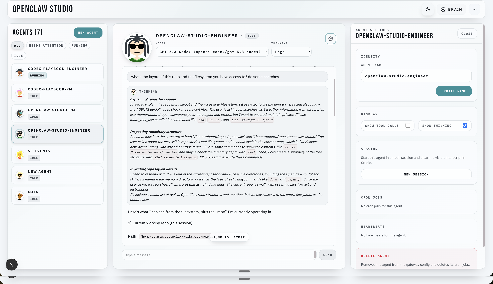

# 奇点科技

[](https://discord.gg/VEpdKJ9e)

奇点科技 is a clean web dashboard for OpenClaw. Use it to connect to your Gateway, see your agents, chat, manage approvals, and configure jobs from one place.

## Get Started (Pick Your Setup)

If your Gateway is already running, pick the scenario that matches where your Gateway and Studio will run:

- [A. Gateway local, Studio local (same computer)](#a-gateway-local-studio-local-same-computer)
- [B. Gateway in the cloud, Studio local (your laptop)](#b-gateway-in-the-cloud-studio-local-your-laptop)
- [C. Studio in the cloud, Gateway in the cloud](#c-studio-in-the-cloud-gateway-in-the-cloud)

All setups use the same install/run path (recommended): `npx -y openclaw-studio@latest`

## Requirements

- Node.js 18+ (LTS recommended)
- An OpenClaw Gateway URL + token
- Tailscale (optional, recommended for remote access)

## A) Gateway local, Studio local (same computer)

```bash
npx -y openclaw-studio@latest
cd openclaw-studio
npm run dev
```

1. Open http://localhost:3000
2. In Studio, set:
   - Upstream URL: `ws://localhost:18789`
   - Upstream Token: your gateway token (for example: `openclaw config get gateway.auth.token`)

## B) Gateway in the cloud, Studio local (your laptop)

Run Studio on your laptop as above, then set an upstream URL your laptop can reach.

Recommended (Tailscale Serve on the gateway host):

1. On the gateway host:
   - `tailscale serve --yes --bg --https 443 http://127.0.0.1:18789`
2. In Studio (on your laptop):
   - Upstream URL: `wss://<gateway-host>.ts.net`
   - Upstream Token: your gateway token

Alternative (SSH tunnel):

1. From your laptop:
   - `ssh -L 18789:127.0.0.1:18789 user@<gateway-host>`
2. In Studio:
   - Upstream URL: `ws://localhost:18789`

## C) Studio in the cloud, Gateway in the cloud

This is the “always-on” setup. The easiest secure version is to keep the Gateway private and expose Studio over Tailscale.

1. On the VPS that will run Studio:
   - Run Studio (same commands as above).
2. Expose Studio over tailnet HTTPS:
   - `tailscale serve --yes --bg --https 443 http://127.0.0.1:3000`
3. Open Studio from your laptop/phone:
   - `https://<studio-host>.ts.net`
4. In Studio, set:
   - Upstream URL: `wss://<gateway-host>.ts.net` (or whatever your gateway is reachable at from the Studio host)
   - Upstream Token: your gateway token

Notes:
- Avoid serving Studio behind `/studio` unless you configure `basePath` and rebuild.
- If Studio is reachable beyond a tailnet, consider setting `STUDIO_ACCESS_TOKEN` (see Configuration below).

## How It Connects (Mental Model)

There are **two separate network paths**:

1. Browser -> Studio: HTTP for the UI, plus a WebSocket to `ws(s)://<studio-host>:3000/api/gateway/ws`
2. Studio -> Gateway (upstream): a second WebSocket opened by the Studio Node server to your configured Upstream URL

This is why `ws://localhost:18789` means “gateway on the Studio host”, not “gateway on your phone”.

## Install from source (advanced)

```bash
git clone https://github.com/grp06/openclaw-studio.git
cd openclaw-studio
npm install
npm run dev
```

## Configuration

Paths and key settings:
- OpenClaw config: `~/.openclaw/openclaw.json` (or `OPENCLAW_CONFIG_PATH` / `OPENCLAW_STATE_DIR`)
- Studio settings: `~/.openclaw/openclaw-studio/settings.json`
- Default gateway URL: `ws://localhost:18789` (override via Studio Settings or `NEXT_PUBLIC_GATEWAY_URL`)
- Optional Studio access gate: set `STUDIO_ACCESS_TOKEN` on the Studio server

## UI guide

See `docs/ui-guide.md` for UI workflows (agent creation, cron jobs, exec approvals).

## PI + chat streaming

See `docs/pi-chat-streaming.md` for how Studio bridges browser WebSocket traffic to the upstream Gateway, how runtime streaming arrives (`chat`/`agent` events), and how the chat UI renders tool calls, thinking traces, and final transcript lines.

## Permissions + sandboxing

See `docs/permissions-sandboxing.md` for how agent creation choices (tool policy, sandbox config, exec approvals) flow from Studio into the OpenClaw Gateway and how upstream OpenClaw enforces them at runtime (workspaces, sandbox mounts, tool availability, and exec approval prompts).

## Troubleshooting

If the UI loads but “Connect” fails, it’s usually Studio->Gateway:
- Confirm the upstream URL/token in the UI (stored on the Studio host at `<state dir>/openclaw-studio/settings.json`).
- `EPROTO` / “wrong version number”: you used `wss://...` to a non-TLS endpoint (use `ws://...`, or put the gateway behind HTTPS).
- Assets 404 under `/studio`: serve Studio at `/` or configure `basePath` and rebuild.
- 401 “Studio access token required”: `STUDIO_ACCESS_TOKEN` is enabled; open `/?access_token=...` once to set the cookie.
- Helpful error codes: `studio.gateway_url_missing`, `studio.gateway_token_missing`, `studio.upstream_error`, `studio.upstream_closed`.

## Architecture

See `ARCHITECTURE.md` for details on modules and data flow.
