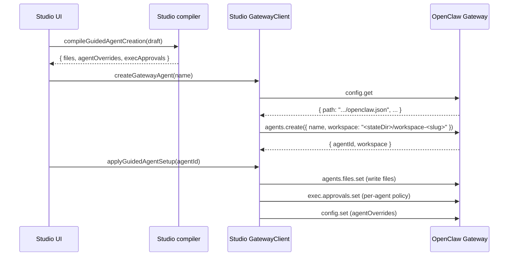

# Permissions, Sandboxing, and Workspaces (Studio -> Gateway -> PI)

This document exists to onboard coding agents quickly when debugging:
- Why an agent can or cannot read/write files
- Why command execution requires approvals (or not)
- Why a sandboxed run behaves differently from a non-sandboxed run
- How “create agent” choices in **OpenClaw Studio** flow into the **OpenClaw Gateway** (often running on an EC2 host) where enforcement actually happens

Scope:
- Studio guided agent creation (the “authority level” / permissions choices) and the exact gateway calls it makes.
- The upstream OpenClaw implementation that persists and enforces those settings at runtime.

Non-scope:
- Full PI internal reasoning/toolchain. Studio does not implement PI logic; it configures and displays the Gateway session.
- Any private EC2 runbook or SSH/hostnames. Keep this doc repo-safe.

## Mental Model (First Principles)

Studio is a UI + proxy. It does two things related to “permissions”:
1. Writes **configuration** into the Gateway (per-agent overrides in `openclaw.json`).
2. Writes **policy** into the Gateway (per-agent exec approvals in `exec-approvals.json`).

The Gateway (OpenClaw) is the enforcement point:
- It decides whether a session is sandboxed.
- It decides which workspace is mounted into the sandbox.
- It constructs the PI toolset (read/write/edit/apply_patch/exec/etc) based on config + sandbox context.
- It asks for exec approvals when policy requires it and broadcasts approval events.

## Glossary

- **Gateway**: OpenClaw Gateway WebSocket server (upstream project).
- **Studio**: this repo. Next.js UI plus a Node WS proxy.
- **Agent**: an OpenClaw agent entry stored in gateway config (`agents.list[]`).
- **Session key**: OpenClaw session identifier. Studio uses `agent:<agentId>:<mainKey>` for the agent’s “main” session.
- **Agent workspace**: a directory on the Gateway host filesystem configured per-agent (where bootstrap files and edits live).
- **Sandbox workspace**: a separate directory used when a session is sandboxed and `workspaceAccess` is not `rw`.
- **Sandbox mode** (`sandbox.mode`): when to sandbox (`off`, `non-main`, `all`).
- **Workspace access** (`sandbox.workspaceAccess`): how the sandbox relates to the agent workspace (`none`, `ro`, `rw`).
- **Tool policy** (`tools.profile`, `tools.alsoAllow`, `tools.deny`): allow/deny gating for PI tools (OpenClaw resolves effective policy).
- **Exec approvals policy**: per-agent `{ security, ask, allowlist }` stored in exec approvals file; drives “Allow once / Always allow / Deny” UX.

## Studio: Where “Permissions” Are Chosen

Guided creation UI:
- `src/features/agents/components/AgentCreateModal.tsx`

Guided draft compilation (UI intent -> concrete gateway setup):
- `src/features/agents/creation/compiler.ts` (`compileGuidedAgentCreation`)

Key outputs of compilation:
- `files`: content for `IDENTITY.md`, `SOUL.md`, etc (written via gateway `agents.files.set`)
- `agentOverrides`:
  - `sandbox.mode`
  - `sandbox.workspaceAccess`
  - `tools.profile`
  - `tools.alsoAllow`
  - `tools.deny`
- `execApprovals` (when exec/runtime tools are enabled):
  - `security`: `deny | allowlist | full`
  - `ask`: `off | on-miss | always`
  - `allowlist`: patterns

### Studio Gotcha: `sandbox.mode` Is Currently Hardcoded

In `compileGuidedAgentCreation`, Studio currently sets:
- `const normalizedSandboxMode = "all";`

That means guided creation always writes `sandbox.mode = "all"` regardless of any UI concept of turning sandboxing off.

## Studio -> Gateway: “Create Agent” End-to-End

Primary entry points:
- `src/features/agents/operations/createAgentOperation.ts` (`createAgentWithOptionalSetup`, `applyGuidedAgentSetup`)
- `src/lib/gateway/agentConfig.ts` (`createGatewayAgent`, `updateGatewayAgentOverrides`)
- `src/lib/gateway/agentFiles.ts` (writes bootstrap files)
- `src/lib/gateway/execApprovals.ts` (writes per-agent exec approvals policy)

Sequence (local gateway):

Remote gateway nuance:
- `createAgentWithOptionalSetup` returns `awaitingRestart: true` for non-local gateways and defers applying the setup until Studio’s restart-block workflow runs. (The settings still end up persisted on the gateway host; Studio is just coordinating when to write them.)

### How Studio Chooses the Default Workspace Path

Studio computes a default workspace path from the gateway’s config path:
- `src/lib/gateway/agentConfig.ts` (`createGatewayAgent`)

Logic:
1. Call `config.get` and read `snapshot.path` (the gateway host config path).
2. Compute `stateDir = dirname(configPath)`.
3. Compute `workspace = join(stateDir, "workspace-" + slugify(name))`.
4. Call `agents.create({ name, workspace })`.

Important: for a remote gateway (EC2), that `workspace` path refers to the gateway host filesystem, not your laptop.

## Studio: Sandbox Env Allowlist Sync (Why It Exists)

When guided setup applies, Studio first calls:
- `src/lib/gateway/sandboxEnvAllowlist.ts` (`ensureGatewaySandboxEnvAllowlistFromDotEnv`)

Behavior:
- Reads dotenv keys from `/api/gateway/dotenv-keys` (best-effort; if the route is missing it returns).
- Patches the gateway config (`config.set`) to ensure `agents.defaults.sandbox.docker.env` includes entries like:
  - `FOO: "${FOO}"`

This is a “plumbing” step so sandbox containers can receive expected environment variables without Studio needing to hardcode them into agent templates.

## OpenClaw (Upstream): What `agents.create` Actually Does

Gateway method:
- `openclaw/src/gateway/server-methods/agents.ts` (`"agents.create"`)

Key behaviors:
- Normalizes `agentId` from the provided `name` (and reserves `"default"`).
- Uses the provided `workspace` and resolves it to an absolute path.
- Writes a config entry for the agent (including the workspace dir and agent dir).
- Ensures the workspace directory exists and that bootstrap files exist (unless `agents.defaults.skipBootstrap` is set).
- Ensures the session transcripts directory exists for the agent.
- Writes the config file only after those directories exist (to avoid persisting a broken agent entry).
- Appends `- Name: ...` (and optional emoji/avatar) to `IDENTITY.md` in the workspace.

So: the “workspace” is not a UI-only concept; it is a real directory created on the Gateway host.

## OpenClaw (Upstream): Sandbox Semantics

Sandbox configuration resolution:
- `openclaw/src/agents/sandbox/config.ts` (`resolveSandboxConfigForAgent`)

Sandbox context creation (where workspace selection happens):
- `openclaw/src/agents/sandbox/context.ts` (`resolveSandboxContext`)

Docker mount behavior:
- `openclaw/src/agents/sandbox/docker.ts` (`createSandboxContainer`)

### Sandbox Mode (`sandbox.mode`)

Modes (as implemented upstream):
- `off`: sessions are not sandboxed.
- `all`: every session is sandboxed.
- `non-main`: sandbox all sessions except the agent’s main session key.

The “main session key” comparison is done against the configured main key (e.g. `agent:<agentId>:main`).

### Workspace Access (`sandbox.workspaceAccess`)

Upstream behavior (important):
- `rw`:
  - The sandbox uses the **agent workspace** as the sandbox root.
  - PI filesystem tools (`read`/`write`/`edit`/`apply_patch`) operate on the agent workspace.
- `ro`:
  - The sandbox uses a **sandbox workspace** as the sandbox root (writable sandbox dir).
  - The real agent workspace is mounted at `/agent` read-only for command-line inspection.
  - PI filesystem tools are additionally restricted: upstream disables write/edit/apply_patch in this mode (see below).
- `none`:
  - The sandbox uses a **sandbox workspace** as the sandbox root.
  - The agent workspace is not mounted into the container.

Sandbox workspace root default:
- `openclaw/src/agents/sandbox/constants.ts` uses `<STATE_DIR>/sandboxes` (where `STATE_DIR` defaults to `~/.openclaw` unless overridden by `OPENCLAW_STATE_DIR`).

Sandbox workspace seeding:
- When using a sandbox workspace root, upstream seeds missing bootstrap files from the agent workspace and ensures bootstrap exists:
  - `openclaw/src/agents/sandbox/workspace.ts` (`ensureSandboxWorkspace`)
  - The sandbox workspace also syncs skills from the agent workspace (best-effort) in `resolveSandboxContext`.

### Hard Enforcement: Filesystem Tool Root Guard

In upstream OpenClaw, sandboxed filesystem tools are rooted and guarded:
- `openclaw/src/agents/pi-tools.read.ts` (`assertSandboxPath` usage)

Result:
- `read`/`write`/`edit` tools cannot access paths outside the sandbox root, even if the container has other mounts (like `/agent`).

This is intentional: the “filesystem tools” and “exec tool” have different access characteristics inside a sandbox.

## OpenClaw (Upstream): Tool Availability and `workspaceAccess=ro`

PI tool construction:
- `openclaw/src/agents/pi-tools.ts` (`createOpenClawCodingTools`)

Key enforcement:
- When sandboxed, upstream removes the normal host `write`/`edit` tools.
- It only adds sandboxed `write`/`edit` tools if `workspaceAccess !== "ro"`.
- It disables `apply_patch` in sandbox when `workspaceAccess === "ro"`.

This is why “`workspaceAccess=ro`” means more than “mount it read-only”:
- It is also a tool-policy gate that prevents direct file writes/edits through PI tools.

### Studio Gotcha: Guided Validation Does Not Match Upstream Enforcement

In `src/features/agents/creation/compiler.ts`, Studio currently validates:
- “Auto file edits require sandbox workspace access ro or rw.”

But upstream OpenClaw disables PI write/edit/apply_patch when `workspaceAccess === "ro"`.

So if “auto-edit” is intended to mean “agent can apply edits via tools to the real workspace”, the effective requirement is:
- `sandbox.workspaceAccess = "rw"`

If `workspaceAccess = "none"`, upstream may still allow sandboxed write/edit tools, but those edits apply to the sandbox workspace, not the agent workspace (and the agent workspace is not mounted).

## OpenClaw (Upstream): Exec Approvals (Policy + Events)

Exec approvals file (defaults upstream):
- `openclaw/src/infra/exec-approvals.ts`
  - default file path: `~/.openclaw/exec-approvals.json`
  - default socket path: `~/.openclaw/exec-approvals.sock`

Gateway methods (persist policy):
- `openclaw/src/gateway/server-methods/exec-approvals.ts`
  - `exec.approvals.get` returns `{ path, exists, hash, file }` (socket token is redacted in responses)
  - `exec.approvals.set` requires a matching `baseHash` when the file already exists (prevents lost updates)

Approval request/resolve + broadcast events:
- `openclaw/src/gateway/server-methods/exec-approval.ts`
  - broadcasts `exec.approval.requested`
  - broadcasts `exec.approval.resolved`

Exec tool approval decision logic:
- `openclaw/src/agents/bash-tools.exec.ts` (calls `requiresExecApproval`, `evaluateShellAllowlist`, etc.)

Studio wiring for policy persistence:
- Studio writes per-agent policy with `exec.approvals.set`:
  - `src/lib/gateway/execApprovals.ts` (`upsertGatewayAgentExecApprovals`)

Studio wiring for UX:
- Studio listens to `exec.approval.requested` and `exec.approval.resolved` and renders in-chat approval cards.
- When the user clicks approve/deny, Studio calls `exec.approval.resolve`.

## Debug Checklist (When Something Feels “Wrong”)

1. Determine if the session is sandboxed and what workspace it is using.
   - Upstream CLI helper: `openclaw sandbox explain --agent <agentId>` (see upstream `src/commands/sandbox-explain.ts`)
2. Confirm what Studio wrote:
   - Agent overrides: `config.get` and inspect `agents.list[]` entry for the agent.
   - Exec approvals: `exec.approvals.get` and inspect `file.agents[agentId]`.
3. If file edits are not happening:
   - Check `sandbox.workspaceAccess` (if `ro`, upstream disables write/edit/apply_patch tools in sandbox).
   - Check tool policy (`tools.profile`, `tools.alsoAllow`, `tools.deny`) for explicit denies on `write`/`edit`/`apply_patch`.
4. If approvals are not showing up:
   - Check exec approvals `security` + `ask`.
   - Check allowlist patterns (a match may suppress prompts when `ask=on-miss`).
5. If the agent can see different files than expected:
   - `workspaceAccess=rw` means “tools operate on the agent workspace”.
   - `workspaceAccess=ro|none` means “tools operate on a sandbox workspace”.
   - `/agent` mount exists only for `workspaceAccess=ro` and is accessible via sandbox exec, not via filesystem tools.
