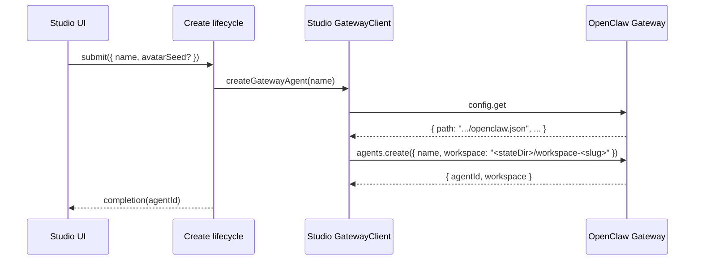

# Permissions, Sandboxing, and Workspaces (Studio -> Gateway -> PI)

This document exists to onboard coding agents quickly when debugging:
- Why an agent can or cannot read/write files
- Why command execution requires approvals (or not)
- Why a sandboxed run behaves differently from a non-sandboxed run
- How “create agent” choices in **奇点科技** flow into the **OpenClaw Gateway** (often running on an EC2 host) where enforcement actually happens

Scope:
- Studio one-step agent creation and post-create authority updates, including exact gateway calls.
- The upstream OpenClaw implementation that persists and enforces those settings at runtime.

Non-scope:
- Full PI internal reasoning/toolchain. Studio does not implement PI logic; it configures and displays the Gateway session.
- Any private EC2 runbook or SSH/hostnames. Keep this doc repo-safe.

## Mental Model (First Principles)

Studio is a UI + proxy. It does two things related to “permissions”:
1. Writes **configuration** into the Gateway (per-agent overrides in `openclaw.json`).
2. Writes **policy** into the Gateway (per-agent exec approvals in `exec-approvals.json`).

The Gateway (OpenClaw) is the enforcement point:
- It decides whether a session is sandboxed.
- It decides which workspace is mounted into the sandbox.
- It constructs the PI toolset (read/write/edit/apply_patch/exec/etc) based on config + sandbox context.
- It asks for exec approvals when policy requires it and broadcasts approval events.

## Glossary

- **Gateway**: OpenClaw Gateway WebSocket server (upstream project).
- **Studio**: this repo. Next.js UI plus a Node WS proxy.
- **Agent**: an OpenClaw agent entry stored in gateway config (`agents.list[]`).
- **Session key**: OpenClaw session identifier. Studio uses `agent:<agentId>:<mainKey>` for the agent’s “main” session.
- **Agent workspace**: a directory on the Gateway host filesystem configured per-agent (where bootstrap files and edits live).
- **Sandbox workspace**: a separate directory used when a session is sandboxed and `workspaceAccess` is not `rw`.
- **Sandbox mode** (`sandbox.mode`): when to sandbox (`off`, `non-main`, `all`).
- **Workspace access** (`sandbox.workspaceAccess`): how the sandbox relates to the agent workspace (`none`, `ro`, `rw`).
- **Tool policy** (`tools.profile`, `tools.alsoAllow`, `tools.deny`): allow/deny gating for PI tools (OpenClaw resolves effective policy).
- **Exec approvals policy**: per-agent `{ security, ask, allowlist }` stored in exec approvals file; drives “Allow once / Always allow / Deny” UX.

## Studio: Where “Permissions” Are Chosen

Agent creation is now create-only:
- `src/features/agents/components/AgentCreateModal.tsx` captures `name` and optional avatar shuffle seed.
- `src/features/agents/operations/createAgentMutationLifecycleOperation.ts` applies queue/guard behavior and calls create.
- `src/lib/gateway/agentConfig.ts` (`createGatewayAgent`) performs `config.get` + `agents.create`.

Authority/permission changes happen after creation from settings:
- `src/features/agents/operations/executionRoleUpdateOperation.ts` (`updateExecutionRoleViaStudio`)
  - updates per-agent exec approvals (`exec.approvals.get` + `exec.approvals.set`)
  - updates runtime tool overrides (`config.get` + `config.patch` via `updateGatewayAgentOverrides`)
  - updates session exec behavior (`sessions.patch` via `syncGatewaySessionSettings`)

### Runtime Tool Groups Used By Post-Create Role Updates

Studio role updates still rely on OpenClaw tool-group expansion (`openclaw/src/agents/tool-policy.ts`), especially:
- `group:runtime` -> runtime execution tools (`exec`, `process`)

What this means in practice:
- Conservative role removes runtime group access and sets exec approvals to deny.
- Collaborative/autonomous roles include runtime group access and set exec approvals to allowlist/full respectively.

## Studio -> Gateway: “Create Agent” End-to-End

Primary entry points:
- `src/features/agents/operations/createAgentMutationLifecycleOperation.ts`
- `src/lib/gateway/agentConfig.ts` (`createGatewayAgent`)

Sequence:

### How Studio Chooses the Default Workspace Path

Studio computes a default workspace path from the gateway’s config path:
- `src/lib/gateway/agentConfig.ts` (`createGatewayAgent`)

Logic:
1. Call `config.get` and read `snapshot.path` (the gateway host config path).
2. Compute `stateDir = dirname(configPath)`.
3. Compute `workspace = join(stateDir, "workspace-" + slugify(name))`.
4. Call `agents.create({ name, workspace })`.

Important: for a remote gateway (EC2), that `workspace` path refers to the gateway host filesystem, not your laptop.

## Studio: Sandbox Env Allowlist Sync (Current Scope)

Create flow does not perform setup writes during initial create anymore. If Studio needs to ensure sandbox env allowlist entries, that behavior should be attached to explicit settings/config operations rather than create-time side effects.

## OpenClaw (Upstream): What `agents.create` Actually Does

Gateway method:
- `openclaw/src/gateway/server-methods/agents.ts` (`"agents.create"`)

Key behaviors:
- Normalizes `agentId` from the provided `name` (and reserves `"default"`).
- Uses the provided `workspace` and resolves it to an absolute path.
- Writes a config entry for the agent (including the workspace dir and agent dir).
- Ensures the workspace directory exists and that bootstrap files exist (unless `agents.defaults.skipBootstrap` is set).
- Ensures the session transcripts directory exists for the agent.
- Writes the config file only after those directories exist (to avoid persisting a broken agent entry).
- Appends `- Name: ...` (and optional emoji/avatar) to `IDENTITY.md` in the workspace.

So: the “workspace” is not a UI-only concept; it is a real directory created on the Gateway host.

## OpenClaw (Upstream): Sandbox Semantics

Sandbox configuration resolution:
- `openclaw/src/agents/sandbox/config.ts` (`resolveSandboxConfigForAgent`)

Sandbox context creation (where workspace selection happens):
- `openclaw/src/agents/sandbox/context.ts` (`resolveSandboxContext`)

Docker mount behavior:
- `openclaw/src/agents/sandbox/docker.ts` (`createSandboxContainer`)

### Sandbox Mode (`sandbox.mode`)

Modes (as implemented upstream):
- `off`: sessions are not sandboxed.
- `all`: every session is sandboxed.
- `non-main`: sandbox all sessions except the agent’s main session key.

The “main session key” comparison is done against the configured main key, with alias-canonicalization:
- Upstream canonicalizes the session key before comparing so that main-session aliases are treated as “main” (see `canonicalizeMainSessionAlias` in upstream sandbox runtime-status).
- If `session.scope` is `global`, the main session key is `global` and `non-main` effectively means “sandbox everything except the global session”.

Upstream implementation reference:
- `openclaw/src/agents/sandbox/runtime-status.ts` (`resolveSandboxRuntimeStatus`)

### Sandbox Scope (`sandbox.scope`)

Sandbox scope controls how sandboxes are shared and therefore what persists between runs:
- `session`: per-session sandbox workspace/container (highest isolation, most churn)
- `agent`: per-agent sandbox workspace/container keyed by agent id (shared across that agent’s sessions)
- `shared`: one sandbox workspace/container shared across everything (lowest isolation)

Upstream implementation reference:
- `openclaw/src/agents/sandbox/types.ts` (`SandboxScope`)
- `openclaw/src/agents/sandbox/shared.ts` (`resolveSandboxScopeKey`)

### Workspace Access (`sandbox.workspaceAccess`)

Upstream behavior (important):
- `rw`:
  - The sandbox uses the **agent workspace** as the sandbox root.
  - PI filesystem tools (`read`/`write`/`edit`/`apply_patch`) operate on the agent workspace.
- `ro`:
  - The sandbox uses a **sandbox workspace** as the sandbox root (writable sandbox dir).
  - The real agent workspace is mounted at `/agent` read-only for command-line inspection.
  - PI filesystem tools are additionally restricted: upstream disables write/edit/apply_patch in this mode (see below).
- `none`:
  - The sandbox uses a **sandbox workspace** as the sandbox root.
  - The agent workspace is not mounted into the container.

Sandbox workspace root default:
- `openclaw/src/agents/sandbox/constants.ts` uses `<STATE_DIR>/sandboxes` (where `STATE_DIR` defaults to `~/.openclaw` unless overridden by `OPENCLAW_STATE_DIR`).

Sandbox workspace seeding:
- When using a sandbox workspace root, upstream seeds missing bootstrap files from the agent workspace and ensures bootstrap exists:
  - `openclaw/src/agents/sandbox/workspace.ts` (`ensureSandboxWorkspace`)
  - The sandbox workspace also syncs skills from the agent workspace (best-effort) in `resolveSandboxContext`.

### Hard Enforcement: Filesystem Tool Root Guard

In upstream OpenClaw, sandboxed filesystem tools are rooted and guarded:
- `openclaw/src/agents/pi-tools.read.ts` (`assertSandboxPath` usage)

Result:
- `read`/`write`/`edit` tools cannot access paths outside the sandbox root, even if the container has other mounts (like `/agent`).

This is intentional: the “filesystem tools” and “exec tool” have different access characteristics inside a sandbox.

## Sandbox Tool Policy (Separate From Per-Agent Tool Overrides)

OpenClaw has an additional sandbox-only tool allow/deny policy:
- `tools.sandbox.tools.allow|deny` (global)
- `agents.list[].tools.sandbox.tools.allow|deny` (per-agent override)

Upstream resolution:
- `openclaw/src/agents/sandbox/tool-policy.ts` (`resolveSandboxToolPolicyForAgent`)

Important nuance:
- If `tools.sandbox.tools.allow` is present and non-empty, it becomes an allowlist.
- If it is set to an empty array, upstream will still auto-add `image` to the allowlist (unless explicitly denied), which often turns “empty” into effectively “image-only”.
- If you want “allow everything” semantics in sandbox policy, prefer `["*"]` over `[]` to avoid the image auto-add corner case.

This is why Studio treats some configs as “broken” and repairs them (see below).

### Policy Layering (Why “Allowed” Can Still Be Blocked)

In a sandboxed session, a tool must pass multiple gates:
- The normal tool policy gates (`tools.profile`, `tools.allow|alsoAllow`, `tools.deny`, plus any provider/group/subagent policies upstream applies).
- The sandbox tool policy gate (`tools.sandbox.tools.allow|deny` resolved for that agent).

So even if Studio enables `group:runtime` for an agent, the tool can still be blocked in sandboxed sessions if sandbox tool policy denies it.

## OpenClaw (Upstream): Tool Availability and `workspaceAccess=ro`

PI tool construction:
- `openclaw/src/agents/pi-tools.ts` (`createOpenClawCodingTools`)

Key enforcement:
- When sandboxed, upstream removes the normal host `write`/`edit` tools.
- It only adds sandboxed `write`/`edit` tools if `workspaceAccess !== "ro"`.
- It disables `apply_patch` in sandbox when `workspaceAccess === "ro"`.

This is why “`workspaceAccess=ro`” means more than “mount it read-only”:
- It is also a tool-policy gate that prevents direct file writes/edits through PI tools.

### Studio Note: Authority Is No Longer Compiled During Create

Studio create flow no longer compiles authority/sandbox settings during initial create.

When authority is changed post-create, Studio uses:
- `src/features/agents/operations/executionRoleUpdateOperation.ts`

That operation updates:
- exec approvals policy (`exec.approvals.set`)
- per-agent tool overrides (`config.patch` via `updateGatewayAgentOverrides`)
- session exec host/security/ask (`sessions.patch`)

Upstream enforcement is unchanged: `workspaceAccess="ro"` still disables PI `write`/`edit`/`apply_patch` in sandboxed sessions.

## Session-Level Exec Settings (Where `exec` Runs)

Separately from per-agent config and exec approvals, OpenClaw supports per-session exec settings:
- `execHost`: `sandbox | gateway | node`
- `execSecurity`: `deny | allowlist | full`
- `execAsk`: `off | on-miss | always`

These are stored in the gateway session store and mutated with `sessions.patch`:
- Upstream method: `openclaw/src/gateway/server-methods/sessions.ts` (`"sessions.patch"`)
- Patch application: `openclaw/src/gateway/sessions-patch.ts`
- Session entry shape includes `execHost|execSecurity|execAsk`: `openclaw/src/config/sessions/types.ts`

Studio uses these fields to keep “what the UI expects” aligned with gateway runtime:
- Hydration derives the expected values using the exec approvals policy plus sandbox mode:
  - `src/features/agents/operations/agentFleetHydrationDerivation.ts`
  - Special case: if `sandbox.mode === "all"` and there are exec overrides, Studio forces `execHost = "sandbox"` to avoid accidentally running on the host.
- On first send (or when out of sync), Studio patches the session:
  - `src/features/agents/operations/chatSendOperation.ts` calls `syncGatewaySessionSettings(...)`
  - Transport: `src/lib/gateway/GatewayClient.ts` (`sessions.patch`)

Net effect:
- Exec approvals policy controls whether the user will be prompted to approve.
- Session exec settings control where execution happens (sandbox vs host) and the default `security/ask` values for runs.

## OpenClaw (Upstream): Exec Approvals (Policy + Events)

Exec approvals file (defaults upstream):
- `openclaw/src/infra/exec-approvals.ts`
  - default file path: `~/.openclaw/exec-approvals.json`
  - default socket path: `~/.openclaw/exec-approvals.sock`

Gateway methods (persist policy):
- `openclaw/src/gateway/server-methods/exec-approvals.ts`
  - `exec.approvals.get` returns `{ path, exists, hash, file }` (socket token is redacted in responses)
  - `exec.approvals.set` requires a matching `baseHash` when the file already exists (prevents lost updates)

Approval request/resolve + broadcast events:
- `openclaw/src/gateway/server-methods/exec-approval.ts`
  - broadcasts `exec.approval.requested`
  - broadcasts `exec.approval.resolved`

Exec tool approval decision logic:
- `openclaw/src/agents/bash-tools.exec.ts` (calls `requiresExecApproval`, `evaluateShellAllowlist`, etc.)

Studio wiring for policy persistence:
- Studio writes per-agent policy with `exec.approvals.set`:
  - `src/lib/gateway/execApprovals.ts` (`upsertGatewayAgentExecApprovals`)

Studio wiring for UX:
- Studio listens to `exec.approval.requested` and `exec.approval.resolved` and renders in-chat approval cards.
- When the user clicks approve/deny, Studio calls `exec.approval.resolve`.

## Debug Checklist (When Something Feels “Wrong”)

1. Determine if the session is sandboxed and what workspace it is using.
   - Upstream CLI helper: `openclaw sandbox explain --agent <agentId>` (see upstream `src/commands/sandbox-explain.ts`)
2. Confirm what Studio wrote:
   - Agent overrides: `config.get` and inspect `agents.list[]` entry for the agent.
   - Exec approvals: `exec.approvals.get` and inspect `file.agents[agentId]`.
3. If file edits are not happening:
   - Check `sandbox.workspaceAccess` (if `ro`, upstream disables write/edit/apply_patch tools in sandbox).
   - Check tool policy (`tools.profile`, `tools.alsoAllow`, `tools.deny`) for explicit denies on `write`/`edit`/`apply_patch`.
4. If approvals are not showing up:
   - Check exec approvals `security` + `ask`.
   - Check allowlist patterns (a match may suppress prompts when `ask=on-miss`).
5. If the agent can see different files than expected:
   - `workspaceAccess=rw` means “tools operate on the agent workspace”.
   - `workspaceAccess=ro|none` means “tools operate on a sandbox workspace”.
   - `/agent` mount exists only for `workspaceAccess=ro` and is accessible via sandbox exec, not via filesystem tools.

## Studio Post-Create “Permissions” Flows (Not Just Creation)

Studio can also change permissions after an agent exists.

### Execution Role Updates (Conservative/Collaborative/Autonomous)

Studio’s “execution role” update flow applies three coordinated changes:
- Exec approvals policy (per-agent, persisted in exec approvals file)
- Tool allow/deny for runtime tools (`group:runtime`) in agent config
- Session exec settings (`execHost|execSecurity|execAsk`) via `sessions.patch`

Code:
- `src/features/agents/operations/executionRoleUpdateOperation.ts` (`updateExecutionRoleViaStudio`)

Why it matters:
- You can have exec approvals configured but still be unable to run commands if `group:runtime` is denied.
- You can have permissive approvals but still be safe if `execHost` is forced to `sandbox` when sandboxing is enabled.

### One-Shot Sandbox Tool Policy Repair

On connect, Studio scans the gateway config for agents that are sandboxed (`sandbox.mode === "all"`) and have an explicitly empty sandbox allowlist (`tools.sandbox.tools.allow = []`), and repairs those entries by setting:
- `agents.list[].tools.sandbox.tools.allow = ["*"]`

Code:
- Detection + repair enqueue: `src/app/page.tsx` (`repair-sandbox-tool-allowlist`)
- Gateway write: `src/lib/gateway/agentConfig.ts` (`updateGatewayAgentOverrides`)

This exists to prevent sandboxed sessions from effectively losing access to almost all sandbox tools due to an empty allowlist interacting with upstream sandbox tool-policy behavior.
