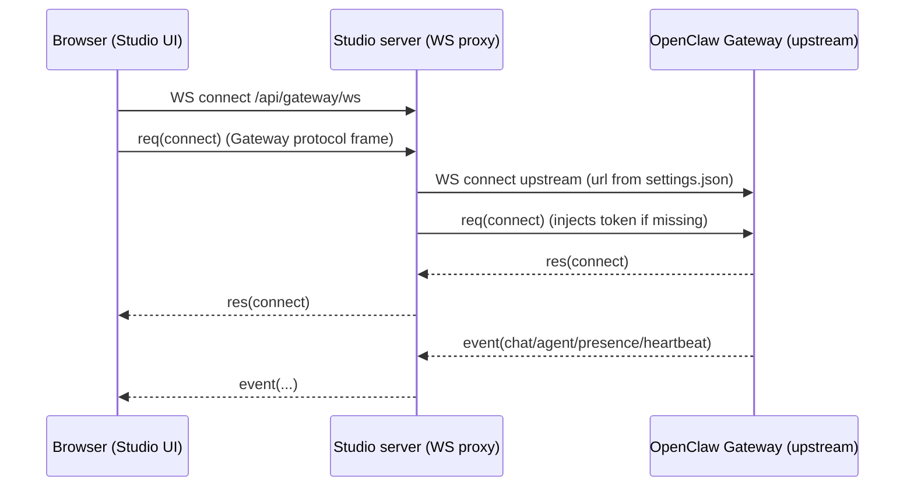

# PI + Chat Streaming (Studio Side)

This document exists to onboard coding agents quickly when debugging chat issues in OpenClaw Studio.

Scope:
- Describes how Studio connects to the OpenClaw Gateway, how runtime streaming arrives over WebSockets, and how the UI renders it.
- Treats **PI** as “the coding agent running behind the Gateway” (an OpenClaw agent). Studio does not implement PI logic; it displays and controls the Gateway session.

Non-scope:
- PI internals and model/tool execution details. Those live in the OpenClaw repository and the Gateway implementation.

## Key Files (Start Here)

- Studio server entry + upgrade wiring: `server/index.js`
- Browser WS bridge to upstream gateway: `server/gateway-proxy.js`
- Browser WS URL (always same-origin `/api/gateway/ws`): `src/lib/gateway/proxy-url.ts`
- Browser gateway protocol client (vendored): `src/lib/gateway/openclaw/GatewayBrowserClient.ts`
- Studio gateway wrapper + connect policy: `src/lib/gateway/GatewayClient.ts`
- Runtime stream classification and merge helpers: `src/features/agents/state/runtimeEventBridge.ts`
- Runtime event executor (streaming -> state -> transcript lines): `src/features/agents/state/gatewayRuntimeEventHandler.ts`
- Chat rendering: `src/features/agents/components/AgentChatPanel.tsx`, `src/features/agents/components/chatItems.ts`
- Message parsing (text/thinking/tool markers): `src/lib/text/message-extract.ts`
- History sync + transcript merge: `src/features/agents/operations/historySyncOperation.ts`, `src/features/agents/state/transcript.ts`

## Relationship To OpenClaw (What’s Vendored Here)

Studio vendors the browser Gateway client used to speak the Gateway protocol:
- Vendored client: `src/lib/gateway/openclaw/GatewayBrowserClient.ts`
- Sync script (from an OpenClaw checkout): `scripts/sync-openclaw-gateway-client.ts`

If a protocol mismatch is suspected (missing event fields, renamed streams, different error codes), start by checking whether Studio’s vendored client is in sync with the Gateway version you’re running.

## Terminology

- Studio: this repo, a Next.js UI with a custom Node server.
- Gateway (upstream): the OpenClaw Gateway WebSocket server (default `ws://localhost:18789`).
- WS bridge / proxy: Studio’s server-side WebSocket that bridges the browser to the upstream Gateway.
- Frame: JSON message over WebSocket (request/response/event).
- Run: a single streamed execution identified by `runId`.
- Session: identified by `sessionKey` (Studio uses `agent:<agentId>:<mainKey>` for main sessions).

## High-Level Network Path

There are two separate WebSocket hops, plus a protocol-level `connect` request:



Files:
- WS proxy entrypoint: `server/index.js`
- WS proxy implementation: `server/gateway-proxy.js`

Notes:
- The browser never opens a WebSocket directly to the upstream Gateway URL. The browser always speaks to the Studio same-origin bridge at `/api/gateway/ws` (computed by `src/lib/gateway/proxy-url.ts`).
- The “upstream gateway URL” shown in Studio settings is used by the Studio server (the proxy) to open the upstream connection.

## End-To-End Flow (PI Run -> UI)

This is the “happy path” you want in your head when debugging:

1. User types in the chat composer and hits Send (`src/features/agents/components/AgentChatPanel.tsx`).
2. Studio calls `chat.send` with `sessionKey` and `idempotencyKey = runId` (`src/features/agents/operations/chatSendOperation.ts`).
3. Gateway runs the agent (PI) for that session.
4. While the run is executing, the Gateway may stream:
   - `event: "agent"` frames for live partial output (`stream: "assistant"`), live thinking (`reason*`/`think*` streams), tool calls/results (`stream: "tool"`), and lifecycle (`stream: "lifecycle"`).
   - `event: "chat"` frames for the chat message stream (`state: "delta" | "final" | ...`).
5. Studio merges those events into:
   - live fields (`streamText`, `thinkingTrace`) via batched `queueLivePatch` (fast UI updates without committing to the transcript yet)
   - committed transcript lines (`outputLines`) via `appendOutput` (final messages, tool lines, meta/timestamp, thinking trace)
6. The chat panel renders:
   - historical transcript from `outputLines`
   - an extra “live assistant” card at the bottom built from `streamText` + `thinkingTrace` while `status === "running"`.

The key wiring is in:
- Event subscription + dispatch: `src/app/page.tsx`
- Runtime event handler: `src/features/agents/state/gatewayRuntimeEventHandler.ts`
- Store reducer: `src/features/agents/state/store.tsx`

## Studio Settings (Where Gateway URL/Token Come From)

Studio persists Gateway connection settings on the Studio host (not in browser storage). The UI loads them into browser memory at runtime:
- `~/.openclaw/openclaw-studio/settings.json` (see `README.md` for the canonical location)

The WS proxy loads these settings server-side and opens the upstream connection.

Files:
- Settings file access (WS proxy): `server/studio-settings.js`
- Settings API route (browser -> server): `src/app/api/studio/route.ts`
- Client-side load/patch coordinator: `src/lib/studio/coordinator.ts`
- Settings storage + fallback behavior used by `/api/studio`: `src/lib/studio/settings-store.ts`

Connection note:
- In the browser, `useGatewayConnection()` stores the upstream URL/token in memory (loaded from `/api/studio`) but connects the WebSocket to Studio via `resolveStudioProxyGatewayUrl()`; the upstream URL is passed as `authScopeKey` (not as the WebSocket URL). See `src/lib/gateway/GatewayClient.ts`.

Token resolution note:
- The Studio server resolves an upstream token from `openclaw-studio/settings.json`, and if it is missing it may fall back to the local OpenClaw config in `openclaw.json` (token + port). This behavior exists in both the WS proxy path (`server/studio-settings.js`) and the `/api/studio` storage layer (`src/lib/studio/settings-store.ts`) and they should remain consistent.
- The WS proxy currently requires an upstream token to be available from the Studio host settings resolver even if the browser `connect` frame includes a token. See the `studio.gateway_token_missing` check in `server/gateway-proxy.js`.

## WebSocket Frame Shapes

Studio expects Gateway frames shaped like:

```json
{ "type": "req", "id": "uuid", "method": "connect", "params": { } }
{ "type": "res", "id": "uuid", "ok": true, "payload": { } }
{ "type": "res", "id": "uuid", "ok": false, "error": { "code": "…", "message": "…" } }
{ "type": "event", "event": "chat", "payload": { } }
```

Types live in:
- `src/lib/gateway/GatewayClient.ts`

### Connect handshake

The first *protocol frame* from the browser must be `req(connect)`. The WS proxy:
- Rejects non-`connect` frames until connected.
- Opens an upstream WS to the configured Gateway URL.
- Injects `auth.token` into the connect params if the connect frame does not already contain a token, and if it does not include a device signature.
- Sets an `Origin` header for the upstream WebSocket derived from the upstream URL (and normalizes loopback hostnames to `localhost`).

Code:
- Connect enforcement + token injection: `server/gateway-proxy.js`

### Connect failures

On failure to load settings or open upstream, the proxy sends an error `res` for the connect request (when possible) and then closes the WS.

Important detail (how errors become actionable in the UI):
- The browser-side Gateway client (`src/lib/gateway/openclaw/GatewayBrowserClient.ts`) closes the WebSocket with close code `4008` and a reason like `connect failed: <CODE> <MESSAGE>` after it receives a failed `res(connect)`. `GatewayClient.connect()` parses that close into `GatewayResponseError(code, message)` for UI retry policy and user-facing errors.
- Separately, the proxy may also close with `1011` / `connect failed`; the “connect failed: …” close reason that the UI parses is produced by the browser client, not the proxy.
- WebSocket close reasons are truncated to 123 UTF-8 bytes in the browser client to avoid protocol errors on long messages.

Error codes used by the proxy include:
- `studio.gateway_url_missing`
- `studio.gateway_token_missing`
- `studio.gateway_url_invalid`
- `studio.settings_load_failed`
- `studio.upstream_error`
- `studio.upstream_closed`

## Reconnects And Retries

There are two layers of retry behavior:

- Transport reconnect (after a successful hello): the vendored browser client reconnects the browser->Studio WebSocket with backoff when it closes, and continues emitting events after reconnect. See `src/lib/gateway/openclaw/GatewayBrowserClient.ts`.
- Initial connect failure retry: when the initial `connect` handshake fails (for example bad token), `GatewayClient.connect()` tears down the vendored client and returns a rejected promise; `useGatewayConnection()` may schedule a limited re-attempt unless the error code is known non-retryable. See `resolveGatewayAutoRetryDelayMs` in `src/lib/gateway/GatewayClient.ts`.

## Optional Studio Access Gate

If `STUDIO_ACCESS_TOKEN` is set on the Studio server, Studio enforces a simple access gate:
- HTTP: blocks `/api/*` routes unless the correct cookie is present; you can set it once via `/?access_token=...`.
- WebSocket: blocks `/api/gateway/ws` upgrades unless the cookie is present.

Files:
- Gate implementation: `server/access-gate.js`
- Gate integration for WS upgrades: `server/index.js`

## Streaming: What the Gateway Sends and How Studio Uses It

Studio classifies gateway events by `event` name:
- `presence`, `heartbeat`: summary refresh triggers
- `chat`: runtime chat messages (delta/final)
- `agent`: runtime per-stream deltas (assistant/thinking/tool/lifecycle)

Code:
- Classification: `src/features/agents/state/runtimeEventBridge.ts`
- Execution: `src/features/agents/state/gatewayRuntimeEventHandler.ts`

## Live Fields vs Committed Transcript (Why Streaming Can “Look Weird”)

Studio intentionally separates:
- Live streaming UI: `AgentState.streamText` and `AgentState.thinkingTrace` are updated via `queueLivePatch`, which batches patches and coalesces multiple deltas before they hit React state (`src/app/page.tsx`).
- Committed transcript: `AgentState.outputLines` is appended via `appendOutput`. These are the lines that become the durable on-screen transcript and are later merged with `chat.history` results (`src/features/agents/state/store.tsx`).

This split is why you can see:
- “live” assistant output update rapidly at the bottom card during a run
- then a finalized assistant message (plus tool lines / thinking trace / meta timestamp) appear in the transcript on `final`

### `event: "chat"` payload

Studio treats `chat` events as the canonical “message” stream for transcript completion. Expected fields:
- `runId`
- `sessionKey`
- `state`: `delta | final | aborted | error`
- `message` (shape varies; Studio extracts text/thinking/tool metadata defensively)

Key behaviors (Studio-side):
- Ignores user/system roles for transcript append (but uses them for status/summary).
- User messages shown in the transcript are primarily from local optimistic send and from `chat.history` sync (not from runtime `chat` user-role events).
- On `final`, appends:
  - a `[[meta]]{...}` line (timestamp and thinking duration when available)
  - a `[[trace]]` thinking block when extracted
  - tool call/result markdown lines when present
  - the assistant text (if any)
- If a `final` assistant message arrives without an extractable thinking trace, Studio may request `chat.history` as recovery.

### `event: "agent"` payload

Studio uses `agent` events for live streaming and richer tool/lifecycle updates. Expected fields:
- `runId`
- `stream`: `assistant | tool | lifecycle | <reasoning stream>`
- `data`: record with `text`/`delta` and stream-specific keys

Stream handling (high-level):
- `assistant`: merges `data.delta` into a live `streamText` for the UI.
- reasoning stream (anything that is not `assistant`, `tool`, `lifecycle` and matches hints like `reason`/`think`/`analysis`/`trace`): merged into `thinkingTrace`.
- `tool`: formats tool call and tool result lines using `[[tool]]` and `[[tool-result]]`.
- `lifecycle`: start/end/error transitions; if a run ends without chat events, Studio may “flush” the last streamed assistant text as a final transcript entry.

Code:
- Runtime agent stream merge + append: `src/features/agents/state/gatewayRuntimeEventHandler.ts`

## How Chat UI Renders Streaming

Studio keeps an `outputLines: string[]` transcript per agent, plus live fields like `streamText` and `thinkingTrace`.

Rendering pipeline:
- `outputLines` contains:
  - user messages as `> ...`
  - assistant messages as raw markdown text
  - tool call/results with prefixes `[[tool]]` and `[[tool-result]]`
  - optional meta lines `[[meta]]{...}` for timestamps and thinking durations
  - optional thinking trace lines `[[trace]] ...`
- The panel derives structured chat items from `outputLines` and (optionally) live streaming state.
- UI toggles that change rendering:
  - `showThinkingTraces`: hides/shows `[[trace]]` thinking entries.
  - `toolCallingEnabled`: when off, tool lines are hidden and some exec tool results may be shown as assistant text.

Files:
- Chat panel UI: `src/features/agents/components/AgentChatPanel.tsx`
- Transcript parsing into items: `src/features/agents/components/chatItems.ts`
- Message extraction helpers (text/thinking/tool parsing): `src/lib/text/message-extract.ts`
- Media line rewrite (images/audio/video rendered in markdown): `src/lib/text/media-markdown.ts`

## Sending Messages (Browser -> PI via Gateway)

Send path (high level):
- UI submits a message through `sendChatMessageViaStudio()` which:
  - Sets agent state to running and clears live streams.
  - Optionally resets local transcript state for `/new` or `/reset` (local UI behavior).
  - Optimistically appends the user line (`> ...`) to the transcript.
  - Ensures session settings are synced once via `sessions.patch` (model/thinking/exec settings) before first send.
  - Calls `chat.send` with `idempotencyKey = runId` and `deliver: false`.

Stop path:
- UI calls `chat.abort` to stop an active run.

Files:
- Send operation: `src/features/agents/operations/chatSendOperation.ts`
- Session settings sync transport: `src/lib/gateway/GatewayClient.ts`
- Stop call site: `src/app/page.tsx`

## Post-Connect Side Effects (Local Gateway Only)

After a successful connection, Studio may mutate gateway config when the upstream gateway URL is local:
- It reads `config.get` and may write `config.set` to ensure `gateway.reload.mode` is `"hot"` for local Studio usage.

File:
- Reload mode enforcement: `src/lib/gateway/gatewayReloadMode.ts`

## Sequence Gaps (Dropped Events)

Gateway event frames may include `seq`. The vendored browser client tracks `seq` and reports gaps (`expected`, `received`) via `onGap`.

Studio behavior on gap:
- Logs a warning.
- Forces a summary snapshot refresh and reconciles running agents.

Files:
- Gap detection: `src/lib/gateway/openclaw/GatewayBrowserClient.ts`
- Gap handling: `src/app/page.tsx`

## History Sync (Recovery, Load More)

Studio can fetch history via `chat.history` and merge it into the transcript.

Key points:
- Studio intentionally treats gateway history as canonical for timestamps/final ordering.
- History merge is designed to avoid duplicates and reconcile local optimistic sends.
- History parsing intentionally skips some system-ish content (heartbeat prompts, restart sentinel messages, and UI metadata prefixes). See `buildHistoryLines()` in `src/features/agents/state/runtimeEventBridge.ts`.
- Transcript v2 can be toggled with `NEXT_PUBLIC_STUDIO_TRANSCRIPT_V2`.
- Transcript debug logs can be enabled with `NEXT_PUBLIC_STUDIO_TRANSCRIPT_DEBUG`.

Files:
- History operation: `src/features/agents/operations/historySyncOperation.ts`
- Transcript merge/sort primitives: `src/features/agents/state/transcript.ts`

## Exec Approvals In Chat (Related To “PI Runs”)

Some runs require exec approval. These are surfaced as in-chat cards and are handled separately from the `chat`/`agent` runtime stream.

Files:
- Event to pending-card state: `src/features/agents/approvals/execApprovalEvents.ts`
- Resolve operation: `src/features/agents/approvals/execApprovalResolveOperation.ts`
- Wiring (subscribe + render): `src/app/page.tsx`, `src/features/agents/components/AgentChatPanel.tsx`

## Media Rendering (Images From Agent Output)

If an agent outputs lines like:
- `MEDIA: /home/ubuntu/.openclaw/.../image.png`

Studio may render them inline:
1. UI rewrites eligible `MEDIA:` lines into markdown images (``) but avoids rewriting inside fenced code blocks.
2. The browser requests `/api/gateway/media`.
3. The API route reads the image either locally (only under `~/.openclaw`) or over SSH for remote gateways, and returns the bytes with the correct `Content-Type`.

Files:
- Rewrite helper: `src/lib/text/media-markdown.ts`
- Media API route: `src/app/api/gateway/media/route.ts`
- SSH helper + env vars (`OPENCLAW_GATEWAY_SSH_TARGET`, `OPENCLAW_GATEWAY_SSH_USER`): `src/lib/ssh/gateway-host.ts`

## Debugging Checklist (When Chat “Feels Buggy”)

Start with the hop where symptoms appear.

WS bridge / connectivity:
- Studio server logs (proxy): `server/gateway-proxy.js`
- Common failures: wrong `ws://` vs `wss://`, missing token, gateway closed, upstream TLS mismatch

Streaming correctness (missing/duplicated output):
- Event classification + runtime stream merge: `src/features/agents/state/gatewayRuntimeEventHandler.ts`
- Text/thinking/tool extraction quirks: `src/lib/text/message-extract.ts`
- UI item derivation and collapsing rules: `src/features/agents/components/chatItems.ts`
- Dedupe of tool lines per run + closed-run ignore window: `src/features/agents/state/gatewayRuntimeEventHandler.ts`

History and ordering issues:
- `chat.history` merge logic and dedupe: `src/features/agents/operations/historySyncOperation.ts`
- Transcript entry ordering/fingerprints: `src/features/agents/state/transcript.ts`

Media not rendering:
- `MEDIA:` rewrite behavior and code-fence skipping: `src/lib/text/media-markdown.ts`
- Image fetch route behavior (local vs SSH, allowlisted extensions, size limits): `src/app/api/gateway/media/route.ts`

If you need Gateway-side observability:
- Capture the exact `connect` settings used by Studio (URL + token are stored server-side in the Studio settings file).
- Inspect Gateway logs on the Gateway host using your environment’s service/log tooling.
